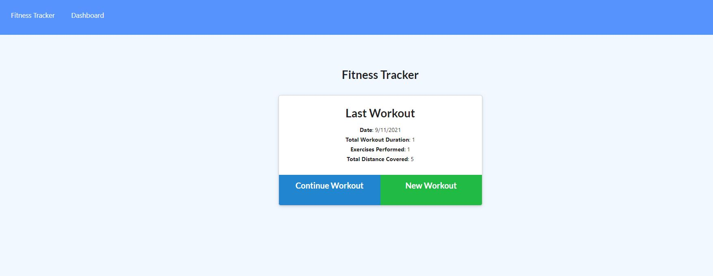
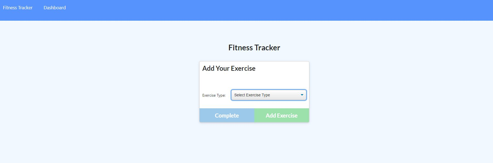
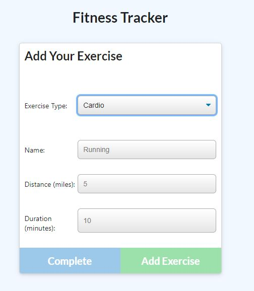
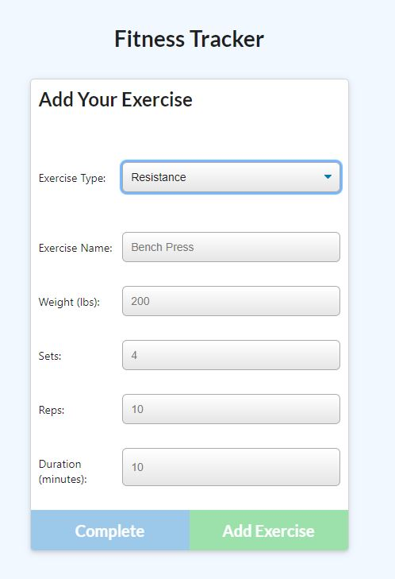
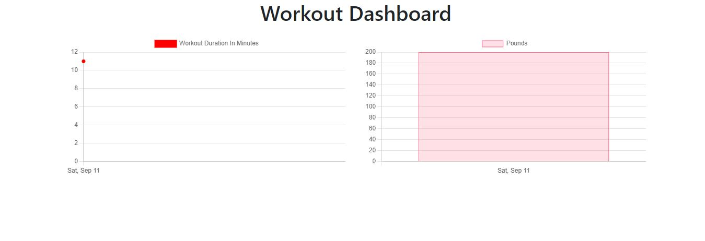

# Workout Tracker

  ## Description

  This app allows you to create a workout and add exercises to that workout. 
  
  ## Table of Contents

- [Description](#description)
- [Installation](#installation)
- [Usage](#usage)
- [Images](#images)
- [Questions](#questions)

## Installation

In the command line please type: 

``` 
npm install 
``` 

## Usage

You can either continue your workout or add a new one. Youare then prompted to add either a resistance or cardio exercise. You can mark your workout as complete. All your exercises show up in your dashboard. Your current workout will show up on the home page.

## Images






## Questions

If you have any questions you can find me on Git hub at [m-ray-ofSunshine](https://github.com/m-ray-ofSunshine)


